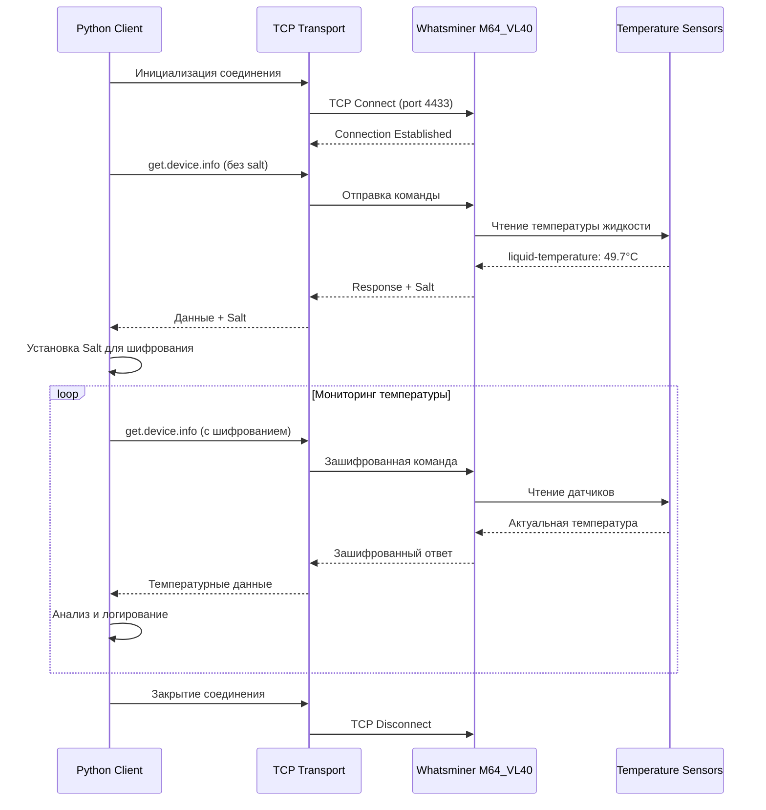

# 🔧 Технические диаграммы и схемы Whatsminer API

## 📊 Диаграмма последовательности операций



## 🏗️ Архитектура системы мониторинга

```
┌─────────────────────────────────────────────────────────────┐
│                    СИСТЕМА МОНИТОРИНГА                      │
├─────────────────────────────────────────────────────────────┤
│  ┌─────────────┐  ┌─────────────┐  ┌─────────────┐         │
│  │   Web UI    │  │  REST API   │  │  Database   │         │
│  │             │  │             │  │             │         │
│  └─────────────┘  └─────────────┘  └─────────────┘         │
│         │                 │                 │              │
│         └─────────────────┼─────────────────┘              │
│                           │                                │
├───────────────────────────┼────────────────────────────────┤
│                           │                                │
│  ┌─────────────────────────▼────────────────────────────┐   │
│  │            PYTHON MONITORING SERVICE               │   │
│  │                                                    │   │
│  │  ┌─────────────┐  ┌─────────────┐  ┌─────────────┐ │   │
│  │  │Temperature  │  │   Logger    │  │   Alerts    │ │   │
│  │  │  Monitor    │  │             │  │   System    │ │   │
│  │  └─────────────┘  └─────────────┘  └─────────────┘ │   │
│  │         │                                          │   │
│  │         ▼                                          │   │
│  │  ┌─────────────────────────────────────────────────┐ │   │
│  │  │         WHATSMINER API CLIENT                  │ │   │
│  │  │                                                │ │   │
│  │  │  ┌─────────────┐  ┌─────────────┐             │ │   │
│  │  │  │WhatsminerAPI│  │WhatsminerTCP│             │ │   │
│  │  │  │     v3      │  │  Transport  │             │ │   │
│  │  │  └─────────────┘  └─────────────┘             │ │   │
│  │  └─────────────────────────────────────────────────┘ │   │
│  └─────────────────────────────────────────────────────┘   │
├─────────────────────────────────────────────────────────────┤
│                        NETWORK LAYER                        │
│                     TCP/IP (Port 4433)                     │
├─────────────────────────────────────────────────────────────┤
│                                                             │
│  ┌─────────────────────────────────────────────────────┐   │
│  │                WHATSMINER M64_VL40                  │   │
│  │                                                     │   │
│  │  ┌─────────────┐  ┌─────────────┐  ┌─────────────┐ │   │
│  │  │   API v3    │  │ Liquid Cool │  │ Temperature │ │   │
│  │  │  Service    │  │   System    │  │   Sensors   │ │   │
│  │  └─────────────┘  └─────────────┘  └─────────────┘ │   │
│  │         │                 │                 │      │   │
│  │         └─────────────────┼─────────────────┘      │   │
│  │                           │                        │   │
│  │  ┌─────────────────────────▼────────────────────┐   │   │
│  │  │            HARDWARE LAYER                   │   │   │
│  │  │                                             │   │   │
│  │  │  💧 Liquid Cooling Loop                    │   │   │
│  │  │  🌡️ Temperature Sensors                    │   │   │
│  │  │  🔌 Power Supply Unit (P738B)              │   │   │
│  │  │  🌪️ Cooling Fans                           │   │   │
│  │  └─────────────────────────────────────────────┘   │   │
│  └─────────────────────────────────────────────────────┘   │
└─────────────────────────────────────────────────────────────┘
```

## 🔄 Поток данных температуры

```
┌─────────────────┐
│ Физические      │
│ датчики         │
│ температуры     │
└─────────┬───────┘
          │ Аналоговый сигнал
          ▼
┌─────────────────┐
│ ADC             │
│ (Аналого-       │
│ цифровой        │
│ преобразователь)│
└─────────┬───────┘
          │ Цифровые данные
          ▼
┌─────────────────┐
│ Микроконтроллер │
│ системы         │
│ охлаждения      │
└─────────┬───────┘
          │ Обработанные данные
          ▼
┌─────────────────┐
│ Основная плата  │
│ управления      │
│ (CB6V5)         │
└─────────┬───────┘
          │ Структурированные данные
          ▼
┌─────────────────┐
│ API Service     │
│ v3.0.1          │
└─────────┬───────┘
          │ JSON Response
          ▼
┌─────────────────┐
│ TCP Transport   │
│ (Port 4433)     │
└─────────┬───────┘
          │ Network Packet
          ▼
┌─────────────────┐
│ Python Client   │
│ Application     │
└─────────────────┘
```

## 🔐 Схема аутентификации и шифрования

```
┌─────────────────┐                    ┌─────────────────┐
│   Python Client │                    │   Whatsminer    │
└─────────┬───────┘                    └─────────┬───────┘
          │                                      │
          │ 1. TCP Connect                       │
          ├─────────────────────────────────────►│
          │                                      │
          │ 2. get.device.info (unencrypted)     │
          ├─────────────────────────────────────►│
          │                                      │
          │ 3. Response + Salt                   │
          │◄─────────────────────────────────────┤
          │                                      │
┌─────────▼───────┐                              │
│ Salt Processing │                              │
│                 │                              │
│ salt = "BQ5hoXV9"                             │
│ key = hash(account + password + salt)          │
│ aes_cipher = AES.new(key, AES.MODE_ECB)       │
└─────────┬───────┘                              │
          │                                      │
          │ 4. Encrypted Commands                │
          ├─────────────────────────────────────►│
          │                                      │
          │ 5. Encrypted Responses               │
          │◄─────────────────────────────────────┤
          │                                      │
```

## 📡 Структура TCP пакета

```
TCP Packet Structure:
┌──────────────────────────────────────────────────────────────┐
│                        TCP HEADER                            │
├──────────────────────────────────────────────────────────────┤
│                    WHATSMINER HEADER                         │
│  ┌─────────────┬─────────────┬─────────────┬─────────────┐   │
│  │   Magic     │   Version   │   Length    │   Reserved  │   │
│  │  (4 bytes)  │  (4 bytes)  │  (4 bytes)  │  (4 bytes)  │   │
│  └─────────────┴─────────────┴─────────────┴─────────────┘   │
├──────────────────────────────────────────────────────────────┤
│                         PAYLOAD                              │
│  ┌─────────────────────────────────────────────────────────┐ │
│  │                   JSON DATA                            │ │
│  │  {                                                     │ │
│  │    "cmd": "get.device.info",                          │ │
│  │    "param": null                                       │ │
│  │  }                                                     │ │
│  └─────────────────────────────────────────────────────────┘ │
└──────────────────────────────────────────────────────────────┘
```

## 🌡️ Карта температурных датчиков

```
WHATSMINER M64_VL40 - Схема расположения датчиков:

┌─────────────────────────────────────────────────────────────┐
│                    КОРПУС МАЙНЕРА                           │
│                                                             │
│  ┌─────────────┐  ┌─────────────┐  ┌─────────────┐         │
│  │ Hash Board  │  │ Hash Board  │  │ Hash Board  │         │
│  │     #1      │  │     #2      │  │     #3      │         │
│  │             │  │             │  │             │         │
│  └─────────────┘  └─────────────┘  └─────────────┘         │
│                                                             │
│  ┌─────────────┐                                           │
│  │ Hash Board  │     ┌─────────────────────────────────┐   │
│  │     #4      │     │      LIQUID COOLING SYSTEM     │   │
│  │             │     │                                 │   │
│  └─────────────┘     │  🌡️ Inlet Temperature          │   │
│                      │  🌡️ Outlet Temperature         │   │
│                      │  🌡️ Liquid Temperature (Main)  │   │
│  ┌─────────────┐     │  💧 Flow Rate Sensor           │   │
│  │ Power Supply│     │  🌪️ Pump Speed Monitor         │   │
│  │   P738B     │     └─────────────────────────────────┘   │
│  │             │                                           │
│  │ 🌡️ PSU Temp │     ┌─────────────────────────────────┐   │
│  │ 🌪️ Fan Speed│     │         CONTROL BOARD           │   │
│  └─────────────┘     │           CB6V5                 │   │
│                      │                                 │   │
│                      │  🌡️ Ambient Temperature        │   │
│                      │  📊 Data Processing             │   │
│                      │  🔌 API Service v3.0.1         │   │
│                      └─────────────────────────────────┘   │
└─────────────────────────────────────────────────────────────┘

Доступные температурные данные через API:
┌─────────────────────────────────────────────────────────────┐
│ power.liquid-temperature  → 🌡️ Основная температура жидкости│
│ power.temp0              → 🌡️ Температура блока питания    │
│ power.fanspeed           → 🌪️ Скорость вентилятора (%)     │
│ miner.environment-temp   → 🌡️ Температура окружающей среды │
└─────────────────────────────────────────────────────────────┘
```

## 📈 Диаграмма состояний системы

```
┌─────────────────┐
│   DISCONNECTED  │
└─────────┬───────┘
          │ connect()
          ▼
┌─────────────────┐
│   CONNECTING    │
└─────────┬───────┘
          │ TCP established
          ▼
┌─────────────────┐
│  AUTHENTICATING │
└─────────┬───────┘
          │ salt received
          ▼
┌─────────────────┐
│   AUTHENTICATED │◄─────────────┐
└─────────┬───────┘              │
          │ get_temperature()     │
          ▼                      │
┌─────────────────┐              │
│   READING_DATA  │              │
└─────────┬───────┘              │
          │ data received        │
          └──────────────────────┘
          │ error/timeout
          ▼
┌─────────────────┐
│     ERROR       │
└─────────┬───────┘
          │ retry/reconnect
          └─────────────────────────┐
                                   │
          ┌────────────────────────┘
          ▼
┌─────────────────┐
│   DISCONNECTED  │
└─────────────────┘
```

## 🔧 Алгоритм обработки ошибок

```
START
  │
  ▼
┌─────────────────┐
│ Попытка         │
│ подключения     │
└─────────┬───────┘
          │
          ▼
     ┌─────────┐
     │ Успех?  │
     └────┬────┘
          │ НЕТ
          ▼
┌─────────────────┐      ┌─────────────────┐
│ Анализ ошибки:  │      │ Счетчик попыток │
│ - Network       │      │ < MAX_RETRIES?  │
│ - Auth          │      └────┬────────────┘
│ - API           │           │ ДА
└─────────┬───────┘           │
          │                  │
          ▼                  │
┌─────────────────┐           │
│ Применить       │           │
│ стратегию       │           │
│ восстановления  │           │
└─────────┬───────┘           │
          │                  │
          ▼                  │
┌─────────────────┐           │
│ Задержка        │           │
│ (exponential    │           │
│ backoff)        │           │
└─────────┬───────┘           │
          │                  │
          └──────────────────┘
          │ НЕТ
          ▼
┌─────────────────┐
│ КРИТИЧЕСКАЯ     │
│ ОШИБКА          │
│ Уведомление     │
│ администратора  │
└─────────────────┘
```

## 💾 Структура данных в памяти

```python
# Структура объекта температурных данных
TemperatureData = {
    'timestamp': datetime.datetime,
    'liquid_temperature': float,      # Основная температура жидкости
    'psu_temperature': float,         # Температура блока питания
    'fan_speed': float,              # Скорость вентилятора %
    'ambient_temperature': float,     # Температура окружающей среды
    'status': str,                   # 'normal', 'warning', 'critical'
    'raw_data': dict,                # Полные данные от API
    'connection_info': {
        'ip_address': str,
        'response_time': float,
        'api_version': str
    }
}

# Структура кэша
Cache = {
    'data': TemperatureData,
    'expiry_time': datetime.datetime,
    'is_valid': bool
}

# Структура конфигурации
Config = {
    'connection': {
        'ip_address': str,
        'port': int,
        'account': str,
        'password': str,
        'timeout': int
    },
    'monitoring': {
        'interval': int,
        'cache_duration': int,
        'max_retries': int,
        'retry_delay': int
    },
    'thresholds': {
        'warning_temp': float,
        'critical_temp': float,
        'max_fan_speed': float
    }
}
```

Эти диаграммы и схемы помогут вам понять полную архитектуру системы мониторинга температуры жидкости Whatsminer и использовать её в ваших будущих проектах. 